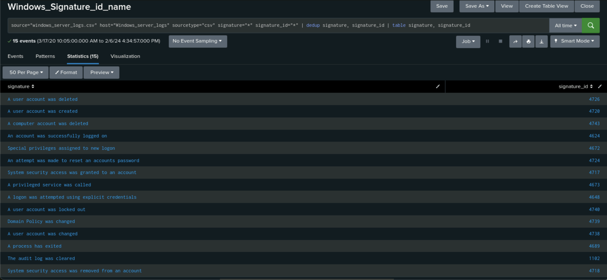
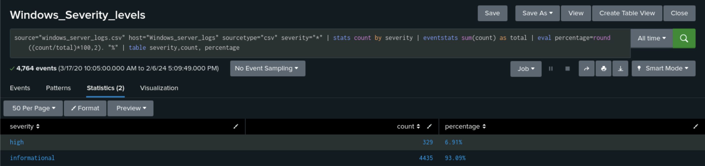
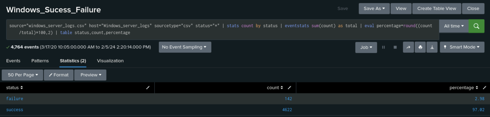
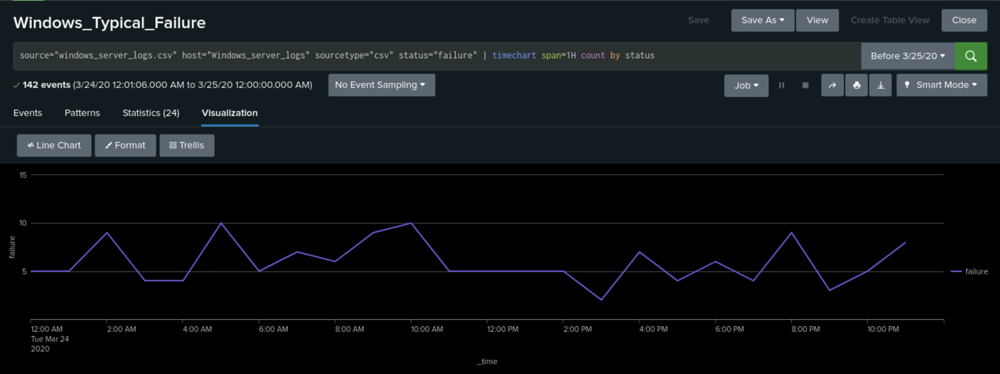
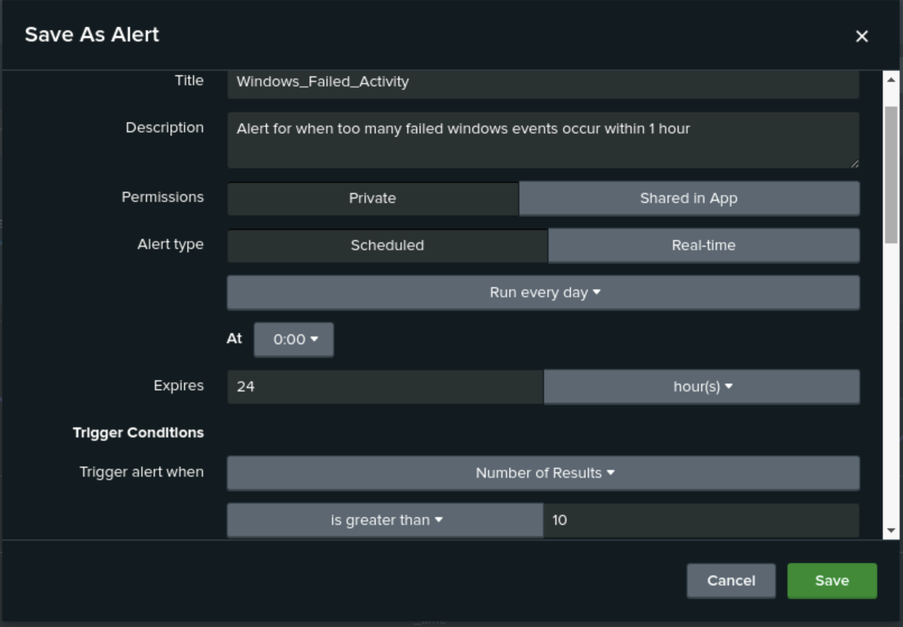

# Splunk-Monitoring
Splunk was utilized to analyze Windows server logs and Apache logs from the fictitious company Virtual Space Industry (VSI). Utilizing the capabilities of Splunk, numerous reports, alerts, and visualization dashboards were created. Logs from a fictional attack on the servers were also analyzed via Splunk.

## Prerequisites
To be able to complete the project the following is needed:

- Splunk
- [Sample Windows log files](Log_Files/windows_server_logs.csv)
- [Sample Apache log files](Log_Files/apache_logs.txt)
- [Attack Windows log files](Log_Files/windows_server_attack_logs.csv)
- [Attack Apache log files](Log_Files/apache_attack_logs.txt)

## Set-Up

To start the project the following needs to be accomplished.
1. Navigate to the Splunk directory inside the machine.
2. Inside the directory, start the splunk.sh script.
   ```
   sudo ./splunk.sh
   ```
3. Once the container is running, utilize any web client to access Splunk.
   ```
   http://localhost:8000
   ```
4. Use the appropriate credentials to log in to Splunk.

## Overview

In this scenario, you will be a SOC analyst at a small company called Virtual Space Industries (VSI). As a SOC analyst, you will utilize Splunk to monitor potential attacks on VSI Windows server logs and VSI Apache server logs. The Windows server is a back-end server that houses VSI's intellectual property. The Apache server is a front-end server used for VSI's public-facing website. The networking team at VSI has provided you with past logs from both servers to develop baselines, reports, alerts, and dashboards for a typical day.
- [Sample Windows log files](Log_Files/windows_server_logs.csv)
- [Sample Apache log files](Log_Files/apache_logs.txt)

Following the analysis of logs from a typical day, VSI experiences several security incidents. At this time, the networking team has provided you with logs from the attack. As a SOC analyst, you will utilize the baselines, reports, alerts, and dashboards developed earlier as monitoring solutions to identify what was attacked.
- [Attack Windows log files](Log_Files/windows_server_attack_logs.csv)
- [Attack Apache log files](Log_Files/apache_attack_logs.txt)

## Analysis of Windows Logs

### Uploading Sample Windows Logs
1. Navigate to the "Add Data" option within Splunk
2. Select the "Upload" option
3. Click on "Select File"
4. Upload [windows_server_logs.csv](Log_Files/windows_server_logs.csv)
5. On the "Set Source Type" select "Next"
   - No changes to the configuration are needed
6. On the "Input Settings" page:
   - Update the "Host" field value to "windows_server_logs"
   - Select "Review"
7. On the "Review" page, verify the correct settings.
8. Select "Submit" to upload the data to Splunk
9. The file will be successfully uploaded once the message "File has been uploaded successfully" appears.
10. Select "Start Searching"
11. **IMPORTANT**:For this project the time picker range must be set for "All Time"
    > Please note this is not the best practice when utilizing Splunk and only applies to this project.

### Developing Monitoring Solution

As a SOC analyst, these logs must be interpreted to determine which data fields are most important to monitor. A quick analysis of the logs reveals the important fields to examine are the following:
- signature_id
- signature
- severity
- status
- user

The logs contain a large amount of data to analyze. To be able to parse through all the data Splunk's Search Processing Language (SPL) will be utilized to manipulate the data.

### Developing Reports

Reports are saved results from a search in Splunk. They are important as they can be run at any time, shared, or added to dashboards. 

For the following queries, make sure to save the search as a report.
   1. Click the "Save As" button
   2. Navigate through the dropdown menu and click "Report"
   3. Enter a descriptive title for the report
   4. Save the report

To begin, it is critical to be able to identify signatures and associate them with the corresponding signature ID as a resource to refer to.

The following SPL query will accomplish the signature and signature ID association:
```
source="windows_server_logs.csv" host="Windows_server_logs" sourcetype="csv" signature="*" signature_id="*" | dedup signature, signature_id | table signature,
signature_id
```



Understanding the severity of events within the Windows logs is important to monitor the health of the servers.

The following SPL will display the severity levels, the count of events, and the percentage:
```
source="windows_server_logs.csv" host="Windows_server_logs" sourcetype="csv" severity="*" | stats count by severity | eventstats sum(count) as total | eval percentage=round((count/total)*100,2). "%" | table severity, count, percentage
```



Monitoring the counts of successful Windows activities versus failed Windows activities can also be used to monitor the health of the server.

The following SPL will display the full count of successful Windows activity and failed Windows activity:
```
source="windows_server_logs.csv" host="Windows_server_logs" sourcetype="csv" status="*" | stats count by status | eventstats sum(count) as total | eval percentage=round((count/total)*100,2). "%" | table status, count, percentage
```



### Developing Alerts

Alerts are another type of saved search in Splunk. Alerts are defined by their ability to be run in real-time or on a schedule. Alerts can be triggered when a defined event action occurs.

For the following queries, make sure to save the search as an Alert.
   1. Click the "Save As" button
   2. Navigate through the dropdown menu and click "Alert"
   3. Enter a title for the Alert
   4. Enter a brief description explaining the alert
   5. Set "Alert Type"
      - Determines how the Alert will run
      - "Schedule"
          - Choose from "every hour", "every day", "every week", "every month", or "Cron Schedule"
      - "Real-time"
   6. Set when the search will expire
   7. Complete the "Trigger Conditions"
      - Set the "Trigger alert when" field
         - Choose between the number of results, hosts, servers, or custom
         - Greater than, less than, equal to, not equal to, drops by, or rises by
         - Desired target number
   8. Complete the "Trigger Actions"
      - Add to trigger alerts
      - Log event: send log event to Splunk receiver endpoint
      - Output results to lookup: send results to CSV lookup file
      - Output results to telemetry endpoint
      - Run a script
      - Send email (***--This will be the trigger action chosen for this project--***)
      - Send to Splunk Mobile
      - Webhook: generic HTTP POST to a specified url
   10. Save the report

A useful alert would be monitoring the number of failed Windows activities that occur over time. Getting this data from the logs would be important to establish a baseline of failed Windows activities on a typical day.

The following SPL will display the number of failed Windows activities over time in 1-hour intervals:
```
source="windows_server_logs.csv" host="Windows_server_logs" sourcetype="csv" status="failure" | timechart span=1H count by status
```



By analyzing the time chart, a typical baseline average of 7 failed Windows events can be assumed, and a typical max of 10 Windows events. This data can be used to create an alert that is set to run hourly and triggered to send an email to the SOC analyst when there are more than 10 failed Window events.


